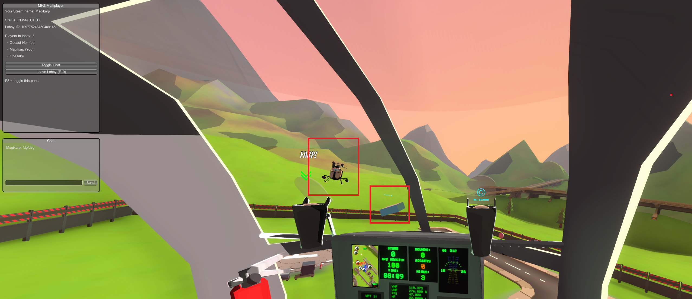

# MHZ Multiplayer

A [BepInEx](https://github.com/BepInEx/BepInEx) plugin that adds co-op multiplayer to **MH-Zombie**, including networked player sync, remote helicopter rendering, an in-game lobby UI, and a time trial scoreboard.

## Features

- Peer-to-peer networked play with a host/join lobby (`LobbyUI.cs`)
- Position and state sync for remote players (`NetworkManager.cs`, `Packets.cs`, `RemotePlayer.cs`)
- Remote helicopters rendered as ghost copies of the local model (`GhostHeliFactory.cs`, `HeliLocator.cs`)
- Time trial scoreboard: finish times are broadcast to the lobby and ranked on an in-game leaderboard (`Scoreboard.cs`)
- Harmony patches to hook the base game without modifying it (`Patches.cs`)
- One-click installer script for Windows (`install_mhz_multiplayer.bat`)

## Requirements

- MH-Zombie (Steam)
- [BepInEx 5.x (x64)](https://github.com/BepInEx/BepInEx/releases)
- .NET Framework 4.6+ SDK to build
- Visual Studio 2022 or VS Code with the C# extension

## Installation & building

**Takes about 5 minutes.**

1. [Code > Zip.](https://github.com/DevTeam6Rabbit/MHZMultiplayer/archive/refs/heads/main.zip) Download the ZIP file.
2. Extract zip file to steam install folder.
   Properties on game, installed files, browse to open install folder. Extract the zip into that folder, it should look like this
3. Open `install_mhz_multiplayer.bat` with notepad/wordpad etc.
   > [!WARNING]
   > Replace the two instances of directories with YOUR MHZ BUILD 13.1 directory. LEAVE THE QUOTES EXACTLY AS IS, AND EVERYTHING ELSE ON THOSE LINES. ONLY REPLACE C:/ETCETC
4. Run `install_mhz_multiplayer.bat`. When it says install complete, close the bat and launch game.
5. F8 to open multiplayer menu. Copy code, join same map.

**You're done**

## Disclaimer

This is an unofficial fan-made mod and is not affiliated with the developers of MH-Zombie. Use at your own risk.
